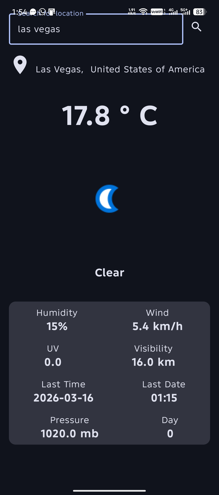
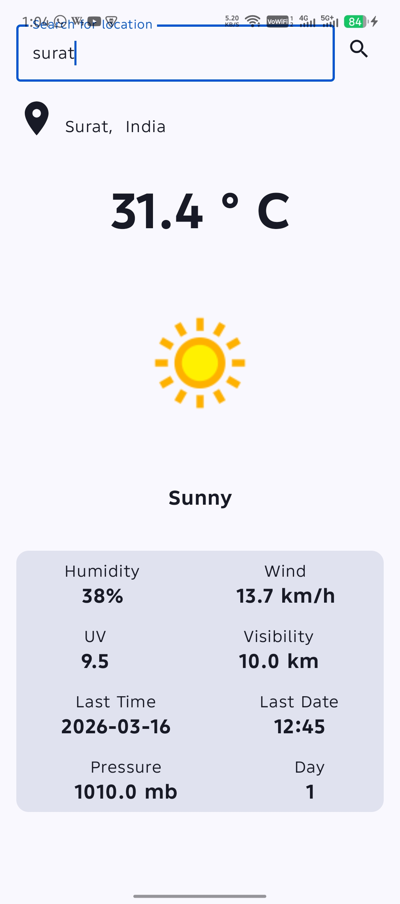

# Weather App - Jetpack Compose

A modern Android application built with **Jetpack Compose** that fetches and displays real-time weather data. This project demonstrates the implementation of clean architecture, reactive UI, and robust network handling.

---

## 📱 Screenshots

<p align="center">
  
  
  
</p>

---

## 🚀 Project Overview
This app follows the **MVVM (Model-View-ViewModel)** architecture to ensure a separation of concerns and a scalable codebase. It showcases how to handle:
* Real-time API communication.
* Reactive state management.
* Asynchronous image loading with modern libraries.

## 🛠 Tech Stack
* **Language:** Kotlin
* **UI Framework:** Jetpack Compose (Modern declarative UI)
* **Networking:** Retrofit 2 & OkHttp
* **JSON Parsing:** Gson
* **State Management:** ViewModel & LiveData
* **Image Loading:** Coil 3
* **Design System:** Material Design 3

## 🏗 Key Implementation Details

### A. Network Layer (Retrofit)
* **WeatherApi Interface:** Dedicated interface to handle `GET` requests for weather data.
* **RetrofitInstance:** Implemented as a singleton to ensure efficient resource usage and connection pooling.
* **Data Models:** Robust mapping of API responses using `WeatherModel`, `Current`, `Location`, and `Condition` classes.

### B. Reactive UI (Compose + ViewModel)
* **State Observation:** `WeatherViewModel` fetches data and exposes it via `LiveData`, which is observed by the UI layer.
* **WeatherPage Composable:** Automatically reacts to state changes, updating the UI for weather data or network status.
* **NetworkResponse Sealed Class:** A clean way to handle UI states: `Loading`, `Success`, and `Error`.

---

## 🔧 Setup & Installation
1. Clone the repository:
   ```bash
   git clone https://github.com/dhruvpatil1606/Weather-App-in-kotlin.git
